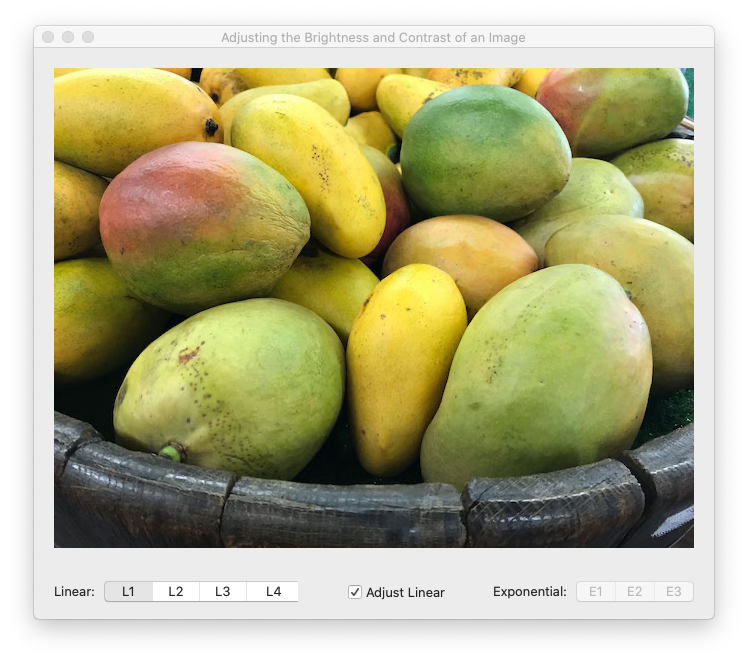

## Adjusting the Brightness and Contrast of an Image

Use a gamma function to apply a linear or exponential curve.

The source code is based on Apple's  article `Adjusting the Brightness and Contrast of an Image` distributed with XCode 11.6.

 
 

On first run, the output window looks like the picture below:

 

Four NSControls make up the UI. The largest control, *imageView* is used to display the rendered image while the other 3 which are at the bottom of the window are used to adjust the gamma of the image.
 

The checkbox labelled *Adjust Linear* can be toggled. The segmented control labelled *Exponential:* is enabled upon unchecking this control and the other segmented control (*Linear:*) is disabled. Conversely, when the control is a checkmarked, the segmented control labelled *Linear:* is enabled and the other segmented control (*Exponential:*) is disabled.
 
 

## Development Plaftorm
 
 

XCode 11.6, Swift 5.0
 
 

Run-time target is set at macOS 10.15.x or later.

 
 

**WebLink:**

Latest version:
 

https://developer.apple.com/documentation/accelerate/adjusting_the_brightness_and_contrast_of_an_image
